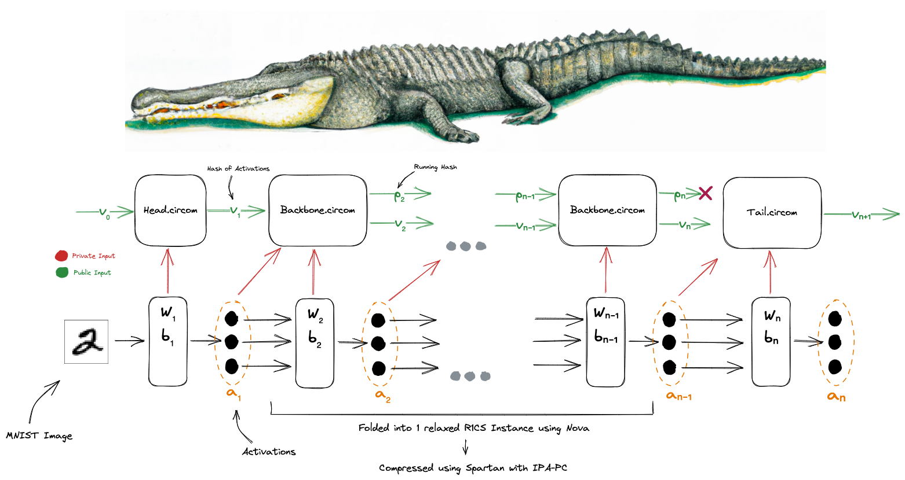

# Zator: Verified inference of a 512-layer neural network using recursive SNARKs 🐊

There has been tremendous progress in the past year toward verifying neural network inference using SNARKs. Along this line of research, notable projects such as [EZKL](https://github.com/zkonduit/ezkl) and work by [D. Kang et al](https://arxiv.org/pdf/2210.08674.pdf) have been able to snark models as complex as a 50-layer MobileNetv2 on the Halo2 proving stack. 

The primary constraint preventing these efforts from expanding to even deeper models is the fact that they attempt to fit the entire computation trace into a single circuit. With [Zator](https://github.com/lyronctk/zator), we wanted to explore verifying one layer at a time using recursive SNARKs, a class of SNARKs that enables an N-step (in our case, N-layer) repeated computation to be verified incrementally. We leverage a recent construction called [Nova](https://github.com/microsoft/Nova) that uses a folding scheme to reduce N instances of repeated computation into a single instance. This instance can then be verified at the cost of a single step. We looked to utilize the remarkably light recursive overhead of folding (10k constraints per step) to snark a network with 512 layers (2.5B total constraints!), which is as deep or deeper than the majority of production AI models today.

## Snarking an arbitrary depth neural network

We spent the last week hacking on a framework for verifying the computation trace for an arbitrary-depth neural network. Our final design composes the Nova and [Spartan](https://eprint.iacr.org/2019/550) proving systems. As we mentioned, Nova employs a folding scheme that instantiates a single relaxed R1CS instance at the beginning of the computation and folding it N times. Folding- the random linear combination- is a fast operation composed of MSMs (rather than expensive, non-parallelizable FFTs) that results in a single claim that encompasses all N steps. Upshot: expensive SNARK machinery only needs to be invoked to prove this *single* instance. This happens when we feed Nova's folded instance into Spartan to create a succinct proof.

The recursive structure for the network exists in the homogenous backbone. Head and tail layers are are proved separately since they cannot be parameterized in the same way as backbone layers (i.e. the head circuit needs to project the input image into the space we work in and the tail circuit needs to produce output probabilities).

## Head, backbone, and tail circuit design 

We split the network into three parts: a head, backbone, and a tail.

We denote the first layer of our neural net to be the head layer. The head accepts a 28x28 image from the MNIST database and outputs activations. The corresponding head layer circuit accepts the input image as a private signal, along with the weights matrix and bias vector as additional private signals. The head layer circuit outputs a hash of the resulting activations, denoted in our diagram by $v_1$. 

Intermediary layers of our neural net have a corresponding backbone circuit that proves the execution of that specific layer. It ingests the activations of the previous layer ($a_{n-1}$), a weight matrix ($W_n$), and a bias vector ($b_n$) as private signals. Two steps are taken in order to prove correct execution of the layer. First, the circuit accepts the hash of the previous activations (i.e $v_{n-1}$) as a public signal. It hashes the passed in activations, and verifies the two values match (i.e it verifies that $hash(a_{n-1}) == v_{n-1}$). Secondly, a "running hash" denoted $p_n$ is a public signal to the circuit. This running hash is defined as $p_n = H(p_{n-1} || H(W_n) || H(b_n))$ and creates a running chain of commitments to weights and bias inputs. This ensures that the proof from the final layer can be tied to a specific model. As public outputs, the circuit produces $p_n$ and $v_n$. 

The final layer in our neural network (the tail layer) corresponds to our tail circuit. Note that $L$ denotes the final layer number (512 in our case). The tail accepts as public input $v_{L-1}$ (the hash of the activations of the previous layer), along with private inputs $W_L$, $b_L$, and $a_{L-1}$. Similar to our backbone circuits, it hashes the passed in activations, and verifies that the two values match (i.e checks $hash(a_{L-1}) == v_{L-1}$). As an output, it produces $v_L$, a hash of the activations produced.

In the end, we have 3 total proofs: 1 for the head layer, 1 for all the backbone layers, and 1 for the final tail layer. A verifier would check the validity of all 3 proofs and trace through their public outputs to ensure that all 3 proofs were part of the same execution trace. Example proofs: [head](https://gist.github.com/varunshenoy/945fe6231b9a077160a0ae2360b854ab#file-head_layer_proof-json), backbone, [tail](https://gist.github.com/varunshenoy/945fe6231b9a077160a0ae2360b854ab#file-tail_layer_proof-json). 

Our three-part design is motivated by Nova's requirement for homogenous computations during folding. In the short term, it is possible to support all types of layers in a single step circuit (single proof) via multiplexing. This is where we do the computations for all layer types every time and use a signal to determine which output activations to pass on. Multiplexing in the step circuit, however, lead to bloated circuits of size $O(|F| * L)$ for $L$ layer types of size $|F|$. [`](https://eprint.iacr.org/2022/1758), the successor to Nova, is the long-term solution for heterogeneous layers.[^1]

[^1]: SuperNova's implementation is still currently under development. 

## A snark-friendly neural network 
Our network consisted of only convolution layers for the backbone. Why only convolutions? 

1. Homogenous architectures (e.g. fully convolutional, fully linear) lend themselves to SNARK recursion, as mentioned earlier. 
2. Linear layers have many, many more weights than a convolutional layer. More weights to hash = more constraints = large proving time. For example, a dense layer for a 28x28 MNIST image has a [784 x 784] weight matrix, which requires ~350M constraints to hash when using 220 rotations on MiMC. 

Our model is trained on [MNIST](https://en.wikipedia.org/wiki/MNIST_database). To represent float values as field elements, we quantized[^2] our weights and activations during training using scale factors and floor divisions. **Note that the quantization error this introduced is a significant limitation of the network we snarked**. Performance was not a main concern of ours since neural net compilation for circuits is solved by other projects such as [EZKL](https://github.com/zkonduit/ezkl). 

Negative numbers were handled by splitting the field. With all operations taken over a prime $p$, all values less than $floor(p/2)$ were treated as positive, and all values above this were treated as negative. Negative numbers with this setup wrap around to become large numbers in the field (e.g -1 maps to $p - 1$).

## Benchmarks 
We benchmark the performance on a 510 layer NN against different configuration of total recursive steps and number of layers per step. 

| Number of Recursive Steps |  Number of Layers per Step |  Prover Time     |  Verifier Time |
| ------------------------- | -------------------------- | ---------------- | -------------- |
| 510                       | 1                          | 26966.845196061s | 24.368612649s  |
| 255                       | 2                          | 29082.011583061s | 47.735558201s  |
| 170                       | 3                          | 30226.823210226s | 62.657654495s  |

These benchmarks were performed on an AWS instance without a GPU attached, which forgoes the significant advantage of built-in GPU support for the MSMs in Nova. 
## Acknowledgements
* [Nalin](https://nibnalin.me/) for writing Nova-Scotia, introducing us to Nova, and guiding us through the project.
* [Hack Lodge](https://hacklodge.org/) for the mentorship, friends, & support.
* [Srinath](http://srinathsetty.net/) for his work on Nova.
* [Dr. Cathie](https://twitter.com/drCathieSo_eth) for her helpful circuit library for common NN operations.
